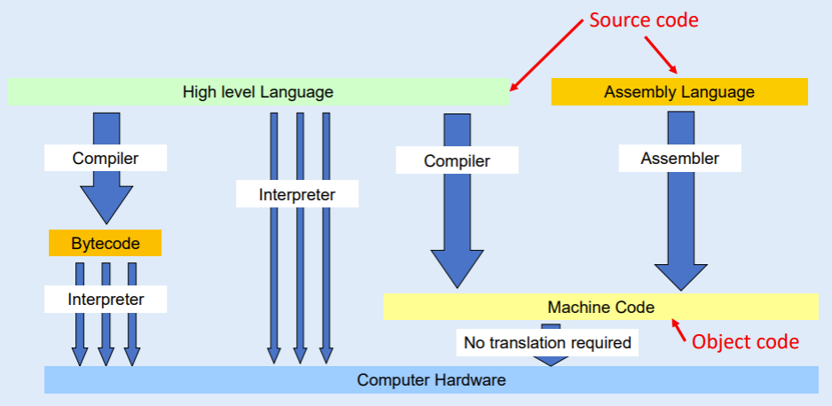

# Coding

## Translators

Translators are used to Convert high level and and assembaly language to low level and mashine code.

high level languages include Python, Html, Java, C# and many more
Low Level languages are: Mashine Code and Assembaly Language

	

