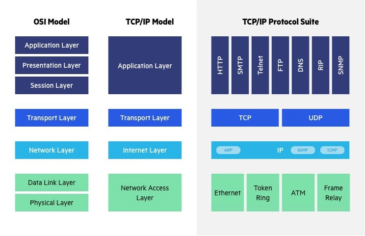

## Network Layers And Protocols
> [!IMPORTANT]
> This Page Is Still A Working Progress.

##### Network Protocols refer to a set of rules and conventions that define how data is transmitted and received over a network. They establish the methods and procedures for communication between different network devices.

### Physical Layer (L1)
Transmission of raw bitstreams over physical mediums.

- USB (Universal Serial Bus): 

- DSL (Digital subscriber line):

- ADSL (Asymmetric Digital Subscriber Line)

- 802.11 WiFi (wireless fidelity):
   - 802.11
      - WiFi 1 Released: 1997 Frequency: 2.4GHz
   - 802.11b
      - WiFi 2 Released: 1999 Frequency: 2.4GHz
   - 802.11a
      - Wifi 3 Released: 1999 Frequency: 5GHz
      - Released: 2003 Frequency: 2.4GHz
   - 802.11g
      - WiFi 4 Released: 2009 Frequency: 2.4GHz, 5GHz 
   - 802.11n
      - WiFi 5 Released: 2013 Frequency: 5GHz 
   - 802.11ac
      - WiFi 6 Released: 2021 Frequency: 2.4GHz, 5GHz 
   - 802.11ax
      - WiFi 6E Released: 2024 Frequency: 6GHz 
   - 802.11be
      - WiFi 7 Released: 2024 Frequency: 2.4GHz, 5GHz, 6GHz
   - 802.11bn
      - WiFI 8 Released: a Frequency: 2.4GHz, 5GHz, 6GHz
 
- 1000BASE-T

### Data Link Layer (L2)
Link Layer Protocols: Protocols that work at the network interface level, facilitating data transfer between devices on the same local network, like Ethernet.

- MAC (Media Access Control)

- Ethernet

- VLan (virtual Local Area Network)

- VPN (Virtual Private Network)

### Network Layer (L3)
Routing data packets through the network.

- IP (Internet Protocol): Routes one packet from a source machine to a destination machine. IP wraps other higher level protocols such as TCP, UDP, etc, which handle routing packets to a specific application/port on the destination machine.

- NAT (Network Address Translation)

### Transport Layer (L4)
Transport Protocols: Protocols responsible for end-to-end communication, ensuring complete data transfer. Examples include TCP (Transmission Control Protocol) and UDP (User Datagram Protocol).

- TCP (Transmission Control Protocol): Routes data to a specific port. TCP provides acknowledgements to verify that a packet was recieved by the destination as well as ensures ordering of packets.

- UDP (User Datagram Protocol): A lightweight protocol that routes a packet to a specific port. UDP does not handle any acknowledgement or ordering of packets.

### Session Layer (L5)
Maintaining sessions and controlling connections.

- SMB

- RTCP

- SOCKetS

### Presentation Layer (L6)
Translation of data formats and encryption.

- TLS

- SSL

### Application Layer (L7)
Application Protocols: These protocols provide services directly to end-users and define how applications interact over a network, such as HTTP for web browsing and SMTP for email.

- HTTP (Hypertext Transfer Protocol): Used to access web pages.

- FTP (File Transfer Protocol): Used for transferring files between computers.
  
- HTTPS (Hypertext Transfer Protocol Secure): Encryption and authentication for requesting and sending secure websites using HTML.
  
- DHCP

- DNS

- NFS

- POP3 (Post Office Protocol version 3): old

- SMTP (Simple Mail Transfer Protocol): Sends an email to an email server. In the name, its simple and is being retired in September 2025.

- SNMP

- NTP

- IRC

- SSH

- IMAP (Internet Message Access Protocol): Used by mail clients to manage and remove mail boxes and retrieve emails from there servers.

## OSI Model
> [!NOTE]
> We Don't Need To Know This For GCSE AQA!

The Open Systems Interconnection (OSI) model describes seven layers that computer systems use to communicate over a network. The OSI model is divided into seven distinct layers, each with specific responsibilities, ranging from physical hardware connections to high-level application interactions.

Each layer of the OSI model interacts with the layer directly above and below it, encapsulating and transmitting data in a structured manner. The OSI model serves as a universal language for networking, providing a common ground for different systems to communicate effectively.

	

### OSI vs. TCP/IP Model
The Transfer Control Protocol/Internet Protocol (TCP/IP) is older than the OSI model and was created by the US Department of Defense (DoD). A key difference between the models is that TCP/IP is simpler, collapsing several OSI layers into one:

- OSI layers 5, 6, 7 are combined into one Application Layer in TCP/IP
- OSI layers 1, 2 are combined into one Network Access Layer in TCP/IP – however TCP/IP does not take responsibility for sequencing and acknowledgement functions, leaving these to the underlying transport layer.

Other important differences:
- TCP/IP is a functional model designed to solve specific communication problems, and which is based on specific, standard protocols. OSI is a generic, protocol-independent model intended to describe all forms of network communication.
- In TCP/IP, most applications use all the layers, while in OSI simple applications do not use all seven layers. Only layers 1, 2 and 3 are mandatory to enable any data communication.

## TCP/IP Model
Transfer Control Protocol/Internet Protocol (TCP/IP)

#### encapsulation
This is where extra data is added to the original data, such as headers and trailers

there are some protocols that require more info to be added to the end. these are trailers.
together the header and the trailer encapsulate the payload(Data) 

### Application
Data from an application is encapsulated:
The application layer works out what the best protocol would be best. these are what manage the communications between applications.
The correct Protocol is added to the header, I.E. HTTPS or HTTP
If required, a termination message(Trailer) is added at the end of the Payload

### Transport
Data is received from the Application layer as a large set of data. the job of the transport layer is to prepare it to be transmitted.

ALL data including the protocol packets are broken up into packet chunks and assigned a packet number in the order of reconstruction. then assigns TCP or UTP for transmission.

If the data packets are sent with TCP, if a packet is missing when being deconstructed then it is sent again.

SOckets are the TCP end point. the consist of IP address and Port number. these persist throughout the transmission connection.

### Network
The segment from the Transport layer is encapsulated by the Internet protocol to create an IP Packet.
Each IP packet is given a header containing multiple pieces of data. these assist with the delivery of data to the destination. 
The two most important pieces of header data is the source and destination IP address.

The source address is what was allocated to the computer that is sending the IP packet. The destination address will be looked up via a DNS server.

### Link
Link Layers are the physical connections, Protocols that work at the network interface level, facilitating data transfer between devices on the same local network, like Ethernet or 4G LTE. 

the IP packet from the network layer are encapsulated in an ethernet frame. this is designed to be transported across a local network.

the header of these ethernet frames contain the source and destination MAC address and a type of field to indicate what they are carrying. Each Network packet gets assigned both MAC addresses, even of they are going to the same destination.

#### Common Physical Protocols:

- MAC (Media Access Control)

- Ethernet

- VLan (virtual Local Area Network)

- VPN (Virtual Private Network)

- 4G LTE (Long Term Evolution)
